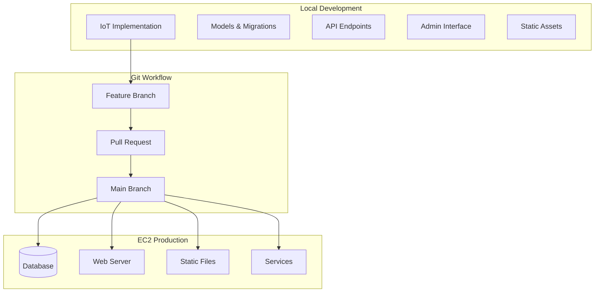

# Design Document: IoT Integration

## Overview

This design outlines the integration of IoT functionality from local development into the main branch and EC2 production deployment. The integration involves merging existing IoT models, migrations, API endpoints, admin interfaces, and static assets through a proper Git workflow followed by production deployment.

The IoT system consists of device management (IoTDevice model) and event logging (IoTEvent model) with REST API endpoints for device communication, Django admin interface for management, and specialized frontend assets for enhanced user experience.

## Architecture

### System Components



### Integration Flow

1. **Code Consolidation**: Merge local IoT implementation into feature branch
2. **Git Workflow**: Create pull request and merge to main branch
3. **Deployment Pipeline**: Deploy to EC2 with migrations and service restart
4. **Validation**: Verify all IoT functionality works in production

## Components and Interfaces

### Django Models

**IoTDevice Model**
- Manages IoT device registration and configuration
- Fields: name, store, device_type, external_id, api_key, thresholds, WiFi settings
- Relationships: ForeignKey to Store, reverse relationship to IoTEvent
- Indexes: external_id (unique), api_key for fast lookups

**IoTEvent Model**
- Stores sensor data and device events
- Fields: device, created_at, event_type, payload, mq9_value
- Relationships: ForeignKey to IoTDevice
- Indexes: device+created_at, device+mq9_value+created_at for performance

### API Endpoints

**IoTEventAPIView** (`/api/iot/events/`)
- Method: POST
- Authentication: API key + device external_id
- Payload: JSON with sensor data (mq9, light, sound, temp, hum)
- Response: Success/error status
- Error handling: Device not found, invalid data format

**IoTConfigAPIView** (`/api/iot/config/`)
- Method: GET
- Authentication: API key + device external_id
- Response: Device configuration (WiFi, thresholds, settings)
- Error handling: Authentication failure, device inactive

### Admin Interface

**IoTDeviceAdmin**
- List display: name, store, device_type, external_id, is_active, last_seen_at
- Filters: store, device_type, is_active
- Search: name, external_id
- Fieldsets: Basic info, API settings, sensor thresholds, WiFi configuration

**IoTEventAdmin**
- List display: created_at, event_type, mq9_value, device, sensor_summary
- Filters: event_type, device__store, created_at
- Auto-refresh: 20-second intervals via JavaScript
- Custom template: Enhanced UI with auto-refresh messaging

**IoTMQ9GraphView** (`/admin/iot/mq9/`)
- Template: iot_mq9_graph.html
- Functionality: MQ-9 sensor data visualization
- Filters: device selection, date range
- Real-time updates: Latest sensor readings

### Static Assets

**iot_event.css**
- Styling for IoT admin interfaces
- Enhanced visual presentation for device management
- Responsive design for various screen sizes

**iot_event_autorefresh.js**
- Auto-refresh functionality for IoT event lists
- 20-second refresh intervals
- User notification of refresh status
- Graceful error handling for failed refreshes

## Data Models

### IoTDevice Schema

```python
class IoTDevice(models.Model):
    name = CharField(max_length=100)
    store = ForeignKey(Store, related_name='iot_devices')
    device_type = CharField(choices=DEVICE_TYPE_CHOICES, default='multi')
    external_id = CharField(max_length=255, unique=True, db_index=True)
    api_key = CharField(max_length=255, db_index=True)
    mq9_threshold = FloatField(null=True, blank=True)
    alert_enabled = BooleanField(default=False)
    alert_email = EmailField(blank=True)
    wifi_ssid = CharField(max_length=64, blank=True)
    wifi_password = CharField(max_length=128, blank=True)
    is_active = BooleanField(default=True)
    last_seen_at = DateTimeField(null=True, blank=True)
```

### IoTEvent Schema

```python
class IoTEvent(models.Model):
    device = ForeignKey(IoTDevice, related_name='events')
    created_at = DateTimeField(auto_now_add=True, db_index=True)
    event_type = CharField(max_length=50, blank=True)
    payload = TextField(blank=True)  # JSON data
    mq9_value = FloatField(null=True, blank=True, db_index=True)
```

### Database Indexes

- `IoTDevice.external_id`: Unique index for device lookup
- `IoTDevice.api_key`: Index for authentication queries
- `IoTEvent.created_at`: Index for time-based queries
- `IoTEvent.mq9_value`: Index for sensor value filtering
- Composite indexes: `(device, created_at)`, `(device, mq9_value, created_at)`

## Correctness Properties

*A property is a characteristic or behavior that should hold true across all valid executions of a system-essentially, a formal statement about what the system should do. Properties serve as the bridge between human-readable specifications and machine-verifiable correctness guarantees.*

Now I need to use the prework tool to analyze the acceptance criteria before writing the correctness properties:

### Property 1: Model Import Consistency
*For any* Python module or context that attempts to import IoTEvent or IoTDevice, the import should succeed without ImportError and return the correct model classes
**Validates: Requirements 1.2, 10.3**

### Property 2: API Sensor Field Acceptance
*For any* valid IoT device API request, the system should accept all standard sensor field names (mq9, light, sound, temp, hum) and process them correctly without field name errors
**Validates: Requirements 3.3, 9.1, 9.2, 9.3, 9.4, 9.5, 10.4**

### Property 3: API Authentication Validation
*For any* combination of device external_id and api_key, the API authentication should either succeed (for valid combinations) or fail gracefully (for invalid combinations) without system errors
**Validates: Requirements 3.4**

### Property 4: API Error Handling
*For any* invalid API request (malformed data, missing fields, invalid field names), the system should return appropriate HTTP error codes and handle errors gracefully without TypeError or system crashes
**Validates: Requirements 3.5, 9.6**

### Property 5: Model Relationship Integrity
*For any* IoTDevice and IoTEvent model operations, all foreign key relationships, constraints, and model creation should work correctly without TypeError, maintaining data integrity
**Validates: Requirements 1.3, 10.5**

### Property 6: Migration Backward Compatibility
*For any* existing database data, applying IoT migrations should preserve all existing data and relationships without corruption or loss
**Validates: Requirements 2.3**

## Error Handling

### API Error Responses

**Authentication Failures**
- Invalid external_id/api_key combination: HTTP 403 Forbidden
- Missing authentication parameters: HTTP 400 Bad Request
- Inactive device: HTTP 403 Forbidden

**Data Validation Errors**
- Malformed JSON payload: HTTP 400 Bad Request with error details
- Invalid field types: HTTP 400 Bad Request with field-specific errors
- Missing required fields: HTTP 400 Bad Request with missing field list

**System Errors**
- Database connection issues: HTTP 500 Internal Server Error
- Model validation failures: HTTP 400 Bad Request with validation errors
- Unexpected exceptions: HTTP 500 Internal Server Error (logged for debugging)

### Migration Error Handling

**Pre-migration Validation**
- Check for conflicting migrations before applying
- Validate database schema compatibility
- Ensure sufficient database permissions

**Migration Rollback Strategy**
- Automatic rollback on migration failure
- Preserve existing data during rollback
- Log detailed error information for troubleshooting

**Data Integrity Protection**
- Use database transactions for atomic migrations
- Validate foreign key constraints after migration
- Verify index creation success

### Admin Interface Error Handling

**Auto-refresh Failures**
- Graceful degradation when auto-refresh fails
- User notification of refresh status
- Fallback to manual refresh option

**Device Configuration Errors**
- Validation of device settings before save
- Clear error messages for invalid configurations
- Prevention of duplicate external_id values

## Testing Strategy

### Dual Testing Approach

The IoT integration requires both unit testing and property-based testing to ensure comprehensive coverage:

**Unit Tests** focus on:
- Specific examples of API endpoint functionality
- Django admin interface integration points
- Migration execution and rollback scenarios
- Static file serving and template rendering
- Edge cases like empty payloads and invalid device configurations

**Property Tests** focus on:
- Universal properties across all API requests and responses
- Model import and relationship integrity across all contexts
- Authentication validation across all device/key combinations
- Error handling across all types of invalid inputs
- Data preservation across all migration scenarios

### Property-Based Testing Configuration

**Testing Framework**: Use Django's built-in testing framework with Hypothesis for property-based testing
- Minimum 100 iterations per property test for thorough coverage
- Each property test references its corresponding design document property
- Tag format: **Feature: iot-integration, Property {number}: {property_text}**

**Test Data Generation**:
- Generate random device configurations (external_id, api_key combinations)
- Generate random sensor data payloads with various field combinations
- Generate random invalid inputs for error handling validation
- Generate random database states for migration testing

**Integration Testing**:
- Test complete API request/response cycles
- Test admin interface functionality with real database operations
- Test migration sequences with realistic data volumes
- Test static file serving in production-like environments

### Test Environment Setup

**Database Testing**:
- Use separate test database for migration testing
- Test with both SQLite (development) and PostgreSQL (production-like)
- Include performance testing for large IoT event datasets

**API Testing**:
- Mock external IoT device requests
- Test with various payload sizes and formats
- Include concurrent request testing for production readiness

**Static Asset Testing**:
- Verify CSS and JavaScript file serving
- Test auto-refresh functionality across different browsers
- Validate responsive design on various screen sizes