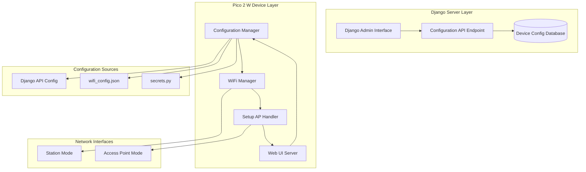

# Design Document: Pico 2 W WiFi Hardening System

## Overview

The Pico 2 W WiFi Hardening System enhances the existing CircuitPython-based WiFi configuration with robust fallback mechanisms, centralized Django management, and reliable Setup AP activation. The system maintains backward compatibility while adding comprehensive configuration validation, priority-based source selection, and improved error handling.

The design follows a layered architecture with clear separation between configuration management, WiFi operations, and web interface components. The system integrates seamlessly with existing Django infrastructure while providing autonomous device operation when server connectivity is unavailable.

## Architecture

The system consists of four main layers:



### Layer Responsibilities

**Django Server Layer**: Provides centralized device configuration management through admin interface and REST API endpoints.

**Configuration Manager**: Implements priority-based configuration source selection, validation, and dummy data detection.

**WiFi Manager**: Handles WiFi connection attempts, failure counting, and Setup AP activation triggers.

**Setup AP Handler**: Manages access point mode, web interface serving, and configuration updates.

## Components and Interfaces

### Configuration Manager

The Configuration Manager is the central component responsible for configuration source prioritization and validation.

```python
class ConfigurationManager:
    def __init__(self, device_id: str, failure_threshold: int = 3):
        self.device_id = device_id
        self.failure_threshold = failure_threshold
        self.config_sources = [
            DjangoConfigSource(),
            LocalFileConfigSource(),
            SecretsConfigSource()
        ]
    
    def get_valid_config(self) -> Optional[DeviceConfig]:
        """Returns first valid configuration from priority-ordered sources"""
        pass
    
    def is_dummy_config(self, config: dict) -> bool:
        """Detects test/placeholder values in configuration"""
        pass
    
    def log_config_decision(self, source: str, reason: str) -> None:
        """Logs configuration source selection and rejection reasons"""
        pass
```

**Interface Contracts:**
- `get_valid_config()` returns None if all sources invalid, triggering Setup AP
- `is_dummy_config()` identifies common test patterns and placeholder values
- Configuration sources implement common `ConfigSource` interface

### WiFi Manager

The WiFi Manager handles connection attempts, failure tracking, and Setup AP activation decisions.

```python
class WiFiManager:
    def __init__(self, config_manager: ConfigurationManager):
        self.config_manager = config_manager
        self.failure_count = 0
        self.connection_state = ConnectionState.DISCONNECTED
    
    def connect_wifi(self) -> bool:
        """Attempts WiFi connection using valid configuration"""
        pass
    
    def should_enter_setup_mode(self) -> bool:
        """Determines if Setup AP should be activated"""
        pass
    
    def reset_failure_count(self) -> None:
        """Resets failure counter on successful connection"""
        pass
```

**State Management:**
- Tracks consecutive WiFi failures independently of server connectivity
- Maintains connection state for proper Setup AP activation logic
- Preserves existing timeout behavior (no custom timeout arguments)

### Setup AP Handler

The Setup AP Handler manages access point mode and configuration web interface.

```python
class SetupAPHandler:
    def __init__(self, device_id: str):
        self.device_id = device_id
        self.ssid = f"PICO-SETUP-{device_id}"
        self.password = "SETUP_PASSWORD"
        self.web_server = None
    
    def activate_setup_mode(self) -> None:
        """Activates access point and starts web server"""
        pass
    
    def handle_config_update(self, form_data: dict) -> bool:
        """Processes configuration updates from web interface"""
        pass
    
    def serve_web_interface(self) -> None:
        """Serves configuration web interface at 192.168.4.1"""
        pass
```

**Web Interface Features:**
- Configuration forms for WiFi, server, device, and API settings
- Real-time validation feedback
- Configuration save and device restart triggers
- Responsive design for mobile device access

### Django Integration Components

#### DeviceConfig Model

```python
class DeviceConfig(models.Model):
    device_id = models.CharField(max_length=50, unique=True)
    wifi_ssid = models.CharField(max_length=100)
    wifi_password = models.CharField(max_length=100)
    server_url = models.URLField()
    api_key = models.CharField(max_length=200)
    device_name = models.CharField(max_length=100)
    created_at = models.DateTimeField(auto_now_add=True)
    updated_at = models.DateTimeField(auto_now=True)
    is_active = models.BooleanField(default=True)
```

#### Configuration API Endpoint

```python
@api_view(['GET'])
def device_config_api(request, device_id):
    """
    Returns device configuration in backward-compatible format
    Endpoint: /booking/api/iot/config/<device_id>/
    """
    try:
        config = DeviceConfig.objects.get(device_id=device_id, is_active=True)
        return Response({
            'wifi': {
                'ssid': config.wifi_ssid,
                'password': config.wifi_password
            },
            'server': {
                'url': config.server_url,
                'api_key': config.api_key
            },
            'device': {
                'name': config.device_name,
                'id': config.device_id
            }
        })
    except DeviceConfig.DoesNotExist:
        return Response({'error': 'Device not found'}, status=404)
```

## Data Models

### Device Configuration Structure

```python
@dataclass
class DeviceConfig:
    wifi_ssid: str
    wifi_password: str
    server_url: str
    api_key: str
    device_name: str
    device_id: str
    source: str  # 'django', 'local_file', 'secrets'
    
    def is_valid(self) -> bool:
        """Validates configuration completeness and format"""
        return all([
            self.wifi_ssid and not self._is_dummy_value(self.wifi_ssid),
            self.wifi_password and not self._is_dummy_value(self.wifi_password),
            self.server_url and self._is_valid_url(self.server_url),
            self.api_key and not self._is_dummy_value(self.api_key)
        ])
    
    def _is_dummy_value(self, value: str) -> bool:
        """Detects common test/placeholder patterns"""
        dummy_patterns = [
            'test_', 'sample_', 'example_', 'dummy_',
            'YOUR_', '_HERE', 'REPLACE_ME', 'TODO'
        ]
        return any(pattern in value.upper() for pattern in dummy_patterns)
```

### Configuration Source Interface

```python
class ConfigSource:
    def load_config(self) -> Optional[DeviceConfig]:
        """Loads configuration from source"""
        raise NotImplementedError
    
    def is_available(self) -> bool:
        """Checks if configuration source is accessible"""
        raise NotImplementedError
    
    def get_priority(self) -> int:
        """Returns source priority (lower = higher priority)"""
        raise NotImplementedError
```

### Connection State Management

```python
class ConnectionState(Enum):
    DISCONNECTED = "disconnected"
    CONNECTING = "connecting"
    CONNECTED = "connected"
    SETUP_MODE = "setup_mode"
    FAILED = "failed"

@dataclass
class WiFiStatus:
    state: ConnectionState
    failure_count: int
    last_attempt: datetime
    current_config: Optional[DeviceConfig]
    setup_reason: Optional[str]  # Why Setup AP was activated
```

## Error Handling

### Configuration Validation Errors

The system handles various configuration validation scenarios:

1. **Malformed JSON**: Log error, skip to next source
2. **Missing Required Fields**: Mark as invalid, continue to next source
3. **Dummy Data Detection**: Log detection reason, skip to next source
4. **Network Unreachable**: Log network error, don't count as config failure

### WiFi Connection Errors

WiFi connection failures are categorized and handled appropriately:

1. **Authentication Failures**: Count toward failure threshold
2. **Network Not Found**: Count toward failure threshold
3. **DHCP Timeout**: Count toward failure threshold
4. **Server Connection Failures**: Do NOT count toward WiFi failure threshold

### File Operation Errors

Robust file handling prevents configuration corruption:

1. **File Not Found**: Log and continue with next source
2. **Permission Errors**: Log error, attempt alternative approach
3. **Disk Full**: Log critical error, attempt cleanup
4. **Backup Creation**: Always backup before overwriting configuration files

### Setup AP Error Recovery

Setup AP mode includes error recovery mechanisms:

1. **Web Server Start Failure**: Retry with alternative port
2. **Access Point Creation Failure**: Log error, attempt restart
3. **Configuration Save Failure**: Preserve existing config, show error message
4. **Invalid Form Data**: Validate and show specific field errors

## Testing Strategy

The testing strategy employs both unit testing and property-based testing to ensure comprehensive coverage of the WiFi hardening system.

### Unit Testing Approach

Unit tests focus on specific scenarios, edge cases, and integration points:

**Configuration Manager Tests:**
- Test dummy data detection with various placeholder patterns
- Test configuration source priority ordering
- Test fallback behavior when sources are invalid
- Test logging of configuration decisions

**WiFi Manager Tests:**
- Test failure counting and threshold behavior
- Test Setup AP activation triggers
- Test connection state transitions
- Test server vs WiFi failure differentiation

**Setup AP Handler Tests:**
- Test web interface serving and form handling
- Test configuration file saving and backup creation
- Test access point creation with correct SSID/password
- Test error handling during configuration updates

**Django Integration Tests:**
- Test API endpoint backward compatibility
- Test DeviceConfig model validation
- Test admin interface functionality
- Test configuration retrieval and formatting

### Property-Based Testing Configuration

Property-based tests will use the `hypothesis` library for Python components and custom generators for CircuitPython components. Each test runs a minimum of 100 iterations to ensure comprehensive input coverage.

**Test Configuration:**
- Minimum 100 iterations per property test
- Custom generators for device IDs, configuration data, and network states
- Shrinking enabled to find minimal failing examples
- Deterministic seeds for reproducible test runs

**Property Test Tagging:**
Each property test includes a comment referencing its design document property:
```python
# Feature: pico-wifi-hardening, Property 1: Configuration priority consistency
def test_config_priority_property(config_sources):
    # Test implementation
```

### Integration Testing

Integration tests verify end-to-end functionality:
- Complete WiFi connection flow with various configuration sources
- Setup AP activation and web interface interaction
- Django API integration with device configuration retrieval
- File system operations and backup/restore functionality

## Correctness Properties

*A property is a characteristic or behavior that should hold true across all valid executions of a system—essentially, a formal statement about what the system should do. Properties serve as the bridge between human-readable specifications and machine-verifiable correctness guarantees.*

Based on the prework analysis and property reflection, the following correctness properties ensure the WiFi hardening system operates reliably across all scenarios:

### Property 1: Setup AP Activation Consistency
*For any* device state and configuration combination, when WiFi failures reach the threshold OR no valid configuration exists OR user triggers setup mode, the device should activate Setup AP mode with correct SSID format "PICO-SETUP-<device_id>" and password "SETUP_PASSWORD"
**Validates: Requirements 1.1, 1.2, 1.3, 1.5, 2.5**

### Property 2: Configuration Source Priority and Fallback
*For any* combination of available configuration sources, the device should select the highest priority valid source (Django > local file > secrets) and fall back to lower priority sources when higher priority sources are invalid or contain dummy data
**Validates: Requirements 2.1, 2.4**

### Property 3: Dummy Data Detection and Rejection
*For any* configuration containing test patterns (test_, sample_, YOUR_, _HERE, etc.), the system should correctly identify it as dummy data and reject it regardless of which source it comes from
**Validates: Requirements 2.2, 2.3**

### Property 4: WiFi vs Server Failure Isolation
*For any* device with active WiFi connection, server connection failures should not trigger Setup AP mode and WiFi connection should be maintained
**Validates: Requirements 1.4**

### Property 5: Configuration Persistence Round Trip
*For any* valid configuration submitted through the Setup AP web interface, saving then loading the configuration should produce equivalent settings and trigger reconnection
**Validates: Requirements 3.3, 3.4**

### Property 6: Django API Response Format Consistency
*For any* valid device configuration request, the Django API should return JSON containing wifi, server, and device sections with all required fields in backward-compatible format
**Validates: Requirements 4.3, 4.4, 6.5**

### Property 7: Configuration Update Propagation
*For any* device configuration updated in Django admin, the changes should be available in API responses immediately and reflected in device behavior on next configuration request
**Validates: Requirements 4.5**

### Property 8: Comprehensive Event Logging
*For any* configuration decision, Setup AP activation, or WiFi connection event, the system should log the event with timestamp, reason, and relevant context information
**Validates: Requirements 5.1, 5.2, 5.5**

### Property 9: File Operation Safety and Recovery
*For any* configuration file operation (read/write/backup), the system should handle errors gracefully, create backups before overwriting, validate JSON structure, and fall back to alternative sources when files are corrupted or missing
**Validates: Requirements 7.1, 7.2, 7.3, 7.4, 7.5**

### Property 10: macOS File Filtering
*For any* file system operation, the system should ignore macOS ._ files and process only relevant configuration files
**Validates: Requirements 5.3**

### Property 11: CircuitPython Constraint Compliance
*For any* HTTP request made by the device, the system should not include timeout arguments in urequests calls and should rely on CircuitPython's default timeout mechanisms
**Validates: Requirements 6.3, 6.4**

### Property 12: Secrets Fallback Functionality
*For any* device state where higher priority sources are unavailable, secrets.py should function as a valid fallback source even when containing sample placeholder values
**Validates: Requirements 5.4**