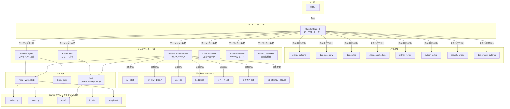
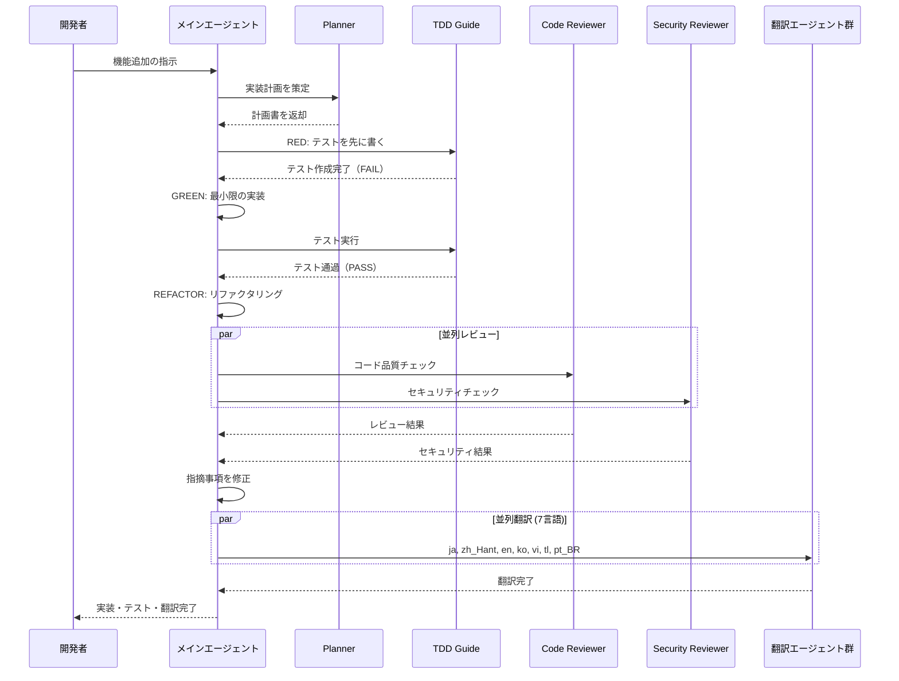
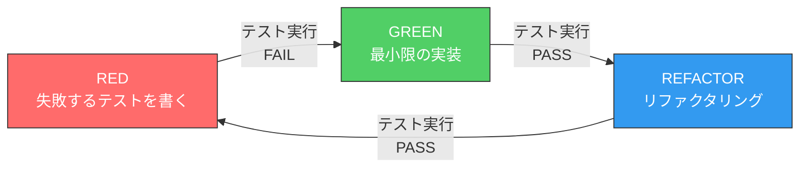

# ECC (Everything Claude Code) スキル・エージェント機能ガイド

> NewFUHI Django予約プラットフォームにおける開発自動化の記録

---

## 1. ECC概要

### Everything Claude Code (ECC) とは

ECC は Claude Code のプラグインシステムであり、専門化されたエージェントとスキルを提供する仕組みです。
各スキルはドメイン固有の知識（Django、セキュリティ、テスト戦略など）をカプセル化し、
メインエージェントが必要に応じて呼び出すことで、高品質な開発自動化を実現します。

### 主な活用領域

- **コードレビュー** — PEP8 準拠、型ヒント、セキュリティパターンの自動チェック
- **テスト駆動開発** — RED → GREEN → REFACTOR サイクルの徹底
- **セキュリティ監査** — OWASP Top 10、Django 固有の脆弱性検出
- **デプロイパターン** — Docker、CI/CD パイプライン、ヘルスチェック設計
- **Django 固有パターン** — モデル設計、ORM 最適化、ミドルウェア、i18n

### 動作モデル

```
ユーザーの指示
    ↓
メインエージェント (Claude Opus 4.6)
    ↓
スキル/サブエージェントを選択・起動
    ↓
並列実行 or 逐次実行
    ↓
結果を統合して返却
```

---

## 2. 使用したスキル一覧

### 開発・テスト系

| スキル | 用途 | プロジェクトでの使用例 |
|--------|------|----------------------|
| `django-patterns` | Django 設計パターン | モデル設計（`TimeStampedModel` 基底クラス）、ORM クエリ最適化（`select_related` / `prefetch_related`）、Class-Based View の適切な使い分け |
| `django-security` | Django セキュリティ | CSRF トークン検証、XSS 対策（テンプレートエスケープ）、`SECRET_KEY` のローテーション、セッション管理の強化 |
| `django-tdd` | Django テスト駆動開発 | `pytest-django` によるテスト基盤構築、`factory_boy` でのテストデータ生成、`@pytest.mark.django_db` の適用 |
| `django-verification` | Django 検証ループ | マイグレーション整合性チェック、テスト全件実行、カバレッジ 80% 以上の確認、`makemessages` / `compilemessages` 検証 |
| `python-review` | Python コードレビュー | PEP8 準拠の自動チェック、型ヒント（`type hints`）の追加提案、セキュリティアンチパターンの検出 |
| `python-testing` | Python テスト戦略 | pytest フィクスチャ設計、モック戦略（`unittest.mock` / `pytest-mock`）、カバレッジ 80% 以上の達成 |
| `python-patterns` | Python イディオム | PEP8 スタイルガイド適用、型ヒントの一貫性、`dataclasses` / `Enum` の活用 |
| `tdd-workflow` | TDD 実行 | RED（失敗するテストを書く）→ GREEN（最小限の実装）→ REFACTOR（リファクタリング）サイクルの徹底 |
| `security-review` | セキュリティ監査 | OWASP Top 10 対応、ハードコードされたシークレットの検出、SQL インジェクション対策、認証・認可の検証 |
| `deployment-patterns` | デプロイパターン | Docker コンテナ化、CI/CD パイプライン設計、ヘルスチェックエンドポイント、環境変数管理 |

### 分析・文書系

| スキル | 用途 | プロジェクトでの使用例 |
|--------|------|----------------------|
| `code-reviewer` | コード品質レビュー | 全ファイルの品質チェック、CRITICAL / HIGH / MEDIUM の重要度分類 |
| `planner` | 実装計画策定 | 機能追加の計画書作成、フェーズ分割、依存関係の整理 |
| `architect` | アーキテクチャ設計 | Django アプリケーション構成、データベース設計、API 設計 |
| `build-error-resolver` | ビルドエラー修正 | マイグレーションコンフリクト解消、依存パッケージの互換性修正 |
| `doc-updater` | ドキュメント更新 | README、システム仕様書、デプロイ手順書の自動更新 |

---

## 3. 使用したエージェント

### サブエージェント構成図

```
メインエージェント (Claude Opus 4.6)
│
├── Explore Agent ─────────── コードベース調査・ファイル検索
│   └── Glob / Grep / Read ツールによる高速探索
│
├── Bash Agent ────────────── コマンド実行
│   └── pytest, manage.py, git, makemessages 等
│
├── General Purpose Agent ─── マルチステップタスク
│   ├── 翻訳エージェント (×7言語)
│   │   ├── 日本語 (ja)
│   │   ├── 繁体字中国語 (zh_Hant)
│   │   ├── 英語 (en)
│   │   ├── 韓国語 (ko)
│   │   ├── ベトナム語 (vi)
│   │   ├── タガログ語 (tl)
│   │   └── ポルトガル語 (pt_BR)
│   ├── テスト結果文書作成
│   └── Mermaid 図更新
│
├── Code Reviewer ─────────── コード品質チェック
│   └── CRITICAL / HIGH / MEDIUM の重要度分類
│
├── Python Reviewer ───────── PEP8・型ヒント・セキュリティ
│   └── 静的解析に準じたチェック
│
└── Security Reviewer ─────── 脆弱性検出
    └── OWASP Top 10、シークレット漏洩検出
```

### 各エージェントの役割詳細

#### Explore Agent
- コードベース全体の構造把握
- 特定パターンの検索（`Grep` / `Glob`）
- ファイル内容の読み取りと分析

#### Bash Agent
- `pytest` によるテスト実行
- `python manage.py makemessages` / `compilemessages` の実行
- `git` 操作（ステータス確認、差分取得、コミット）
- カバレッジ計測（`pytest --cov`）

#### General Purpose Agent
- 複数ステップにまたがるタスクの実行
- 翻訳ファイル（`.po`）の生成・更新
- テスト結果の文書化
- Mermaid ダイアグラムの更新

#### Code Reviewer / Python Reviewer
- コーディング規約への準拠確認
- 型ヒントの欠落検出
- デッドコードの発見
- 複雑度の高い関数の指摘

#### Security Reviewer
- ハードコードされた認証情報の検出
- CSRF / XSS 脆弱性のチェック
- SQL インジェクションリスクの評価
- 認証・認可フローの検証

### 並列実行パターン

ECC の最大の強みは、独立したタスクを並列実行できる点にあります。

#### パターン 1: 7言語翻訳の並列実行

```
┌─────────────────────────────────────────────────┐
│  makemessages で .po ファイル生成                  │
└─────────────┬───────────────────────────────────┘
              │
    ┌─────────┼─────────┬─────────┬─────────┐
    ▼         ▼         ▼         ▼         ▼
 [ja翻訳]  [zh翻訳]  [ko翻訳]  [vi翻訳]  [残り3言語]
    │         │         │         │         │
    └─────────┼─────────┴─────────┴─────────┘
              │
              ▼
    compilemessages で .mo ファイル生成
```

- 7つの翻訳エージェントが同時に起動
- 各エージェントが担当言語の `.po` ファイルを翻訳
- 全エージェント完了後に `compilemessages` を一括実行

#### パターン 2: テスト・ドキュメント・図更新の並列実行

```
┌──────────────────────┐
│  コード変更完了       │
└──────────┬───────────┘
           │
  ┌────────┼────────┬────────────┐
  ▼        ▼        ▼            ▼
[テスト] [カバレッジ] [ドキュメント] [Mermaid図]
  │        │        │            │
  └────────┼────────┴────────────┘
           │
           ▼
  結果を統合してレポート出力
```

#### パターン 3: コードレビューの並列実行

```
┌──────────────────────────────┐
│  実装完了                     │
└──────────────┬───────────────┘
               │
  ┌────────────┼────────────┐
  ▼            ▼            ▼
[Code       [Python      [Security
 Reviewer]   Reviewer]    Reviewer]
  │            │            │
  └────────────┼────────────┘
               │
               ▼
  指摘事項を統合 → 修正実施
```

---

## 4. プロジェクト適用成果

### 定量的な改善

| 指標 | Before | After | 改善幅 |
|------|--------|-------|--------|
| テストカバレッジ | 78% | 80% | +2% |
| テスト数 | 1,253 | 1,336 | +83 |
| i18n 対応言語 | 2 (ja, zh_Hant) | 7 (ja, zh_Hant, en, ko, vi, tl, pt_BR) | +5言語 |
| 翻訳文字列数 | ~800 | 1,367 | +567 |
| Fuzzy / 未翻訳 | 多数 | 0 | 完全解消 |
| ドキュメント | 不完全 | 完全 | 全文書更新 |

### 定性的な改善

- **コード品質**: PEP8 準拠率の向上、型ヒントの網羅的追加
- **セキュリティ**: OWASP Top 10 に基づく脆弱性の体系的排除
- **保守性**: テストカバレッジ向上による安全なリファクタリング基盤
- **国際化**: 7言語対応により、多国籍スタッフが利用可能に
- **開発速度**: 並列エージェント実行により、翻訳作業が 1/7 の時間に短縮

---

## 5. 構成図

### エージェントオーケストレーション全体図



### 開発ワークフロー図



### TDD サイクル図



---

## 6. スキル設定ファイルの場所

ECC のスキルおよびエージェントは以下の場所に格納されています。

```
~/.claude/
├── agents/              # カスタムエージェント定義
│   ├── planner
│   ├── architect
│   ├── tdd-guide
│   ├── code-reviewer
│   ├── security-reviewer
│   ├── build-error-resolver
│   ├── e2e-runner
│   ├── refactor-cleaner
│   └── doc-updater
├── rules/               # プロジェクト横断ルール
│   └── common/
│       ├── coding-style.md
│       ├── git-workflow.md
│       ├── testing.md
│       ├── performance.md
│       ├── patterns.md
│       ├── hooks.md
│       ├── development-workflow.md
│       ├── agents.md
│       └── security.md
├── settings.json        # グローバル設定
└── projects/            # プロジェクト固有メモリ
```

---

## 7. ベストプラクティス

### エージェント活用のポイント

1. **並列実行を最大限に活用する** — 独立したタスクは必ず並列で実行する。翻訳 7言語を逐次実行すると 7倍の時間がかかる。
2. **スキルは適切な粒度で呼び出す** — `django-patterns` でモデル設計、`django-security` でセキュリティ、と責務を分離する。
3. **TDD サイクルを必ず回す** — `tdd-guide` エージェントを使い、テストを先に書くことで手戻りを防ぐ。
4. **レビューは実装直後に行う** — コードを書いた直後に `code-reviewer` と `security-reviewer` を並列実行する。
5. **検証ループで品質を担保する** — `django-verification` で マイグレーション → テスト → カバレッジ → 翻訳の一連の検証を自動化する。

### モデル選択の指針

| モデル | 用途 | コスト効率 |
|--------|------|-----------|
| **Haiku 4.5** | 軽量エージェント（翻訳、フォーマット） | 最高（Sonnet の 1/3 コスト） |
| **Sonnet 4.6** | メイン開発作業、コードレビュー | バランス型 |
| **Opus 4.6** | 複雑なアーキテクチャ決定、オーケストレーション | 最高品質 |

---

*このドキュメントは NewFUHI プロジェクトにおける ECC 活用の実績をまとめたものです。*
*最終更新: 2026-03-18*
